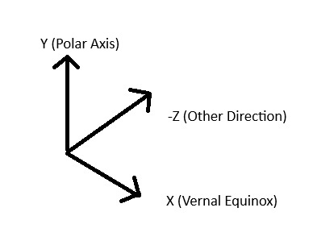
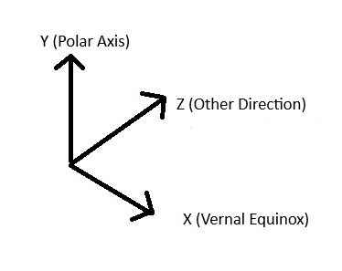
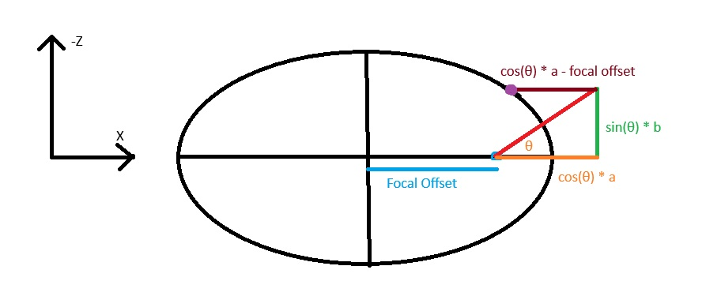

This file documents the core simulation of the project. It can be assumed that implementation is the same across both Godot and Unity versions unless stated otherwise. The differences between the Unity and Godot versions is documented [here](Godot%20vs%20Unity%20Implementations).
# Orbiting Body Hierarchy
The core of the simulation is the "OrbitingBody" class (scene in Godot and prefab in Unity, essentially a class by OOP terms).  This is designed to recursively create the solar system. The example below visualises this, with both the "central body" and the satellites all being of the orbiting body class. 


So for example, in the Godot project, the sun is initialised, this then loads the data and initialises the 8 planets of the solar system. When each planet is initialised, they load the data of their moons, for example Mars loading and initialising Phobos and Deimos. The hierarchy is determined by the "satellites" array in each body's JSON file.

The orbiting body class is contains the following elements, visualised in the diagram below:


**Origin:** This is not an element, just showing where the origin of the object is.
**Orbital Plane:** This is oriented to achieve orbits in the third dimension, more details [here](#1.%20Orienting%20the%20Orbital%20Plane).
**Orbit Visual**: This is a visualisation of the orbital path of the body.
**Body:** This contains the model and the label of the body. Satellites are added as children of this element.
**Label:** This shows the name of the body, being populated with the "name" value in the data JSON. Every frame it is updated so that it always faces the player camera, and is resized based on the camera distance so that it always appears the same size to the user.
**Model:** This is visualisation of the body itself. This is what is rotated. See the [rotation section](#Rotation) for more information.

The hierarchy of the elements are as follows (Godot screenshot), where "Sun" in this example is the "model" element.


The central body, such as the sun in the Godot simulation, is set so that it doesn't orbit and  instead stays at the centre point. The orbital plane is not oriented nor is an orbit visual shown in this case:


Satellites are added as children to the body element. A simulation with satellites looks as follows:


# Time


# Calculating Orbits
Great video covering the orbital elements:
https://youtu.be/AReKBoiph6g?si=trhB5TMWy28KLwfz

A separate test application of the orbital elements can be found in the repository in the folder GodotOrbitSimulation, which demonstrates how the orbits are calculated.
## Key Terms
### Earth Centred Inertial (ECI) Frame (referred to as equatorial plane)
In a typical xyz coordinate system where x is right, y is forward and z is up:
**X Axis:** Vernal Equinox
**Z:** Polar Axis
**Y:** The other direction

### Vernal Equinox
If you imagined the sun rotated around the Earth, the Vernal Equinox would be the line between the two points where the sun ascends up through the equatorial plane and descends through the equatorial plane. 

In both the Godot and Unity versions of the simulation, the Global Positive X vector of the scene is treated as the vernal equinox in calculations.

In the Godot Coordinate system, the vectors are as follows:


In the Unity coordinate system, the vectors are as follows:

### Orbital Plane
The orbit lies on an orbital plane, separate to the Earth Centred Inertial Frame mentioned above.
This plane is oriented based on parameters before the orbit is drawn onto it.
### Ascending & Descending Node
A body in an orbit on the orbital plane will cross the equatorial plane at two points, when it is descending through it, and when it is ascending upwards through it. These two points are called the descending node and ascending node respectively.
### Line of Ascending Node
This is the line that joins the ascending and descending node points.

It is the line where the orbital plane intersects with the equatorial plane. 
### Periapsis
This is the Closest point on the orbit to the central body. Always the point directly on the positive x axis this orbtial simulation.
### Keplerian Orbital Elements
A orbit is typically defined mathematically by the following 6 parameters:
- Semi-major Axis
- Eccentricity
- Inclination
- Longitude of Ascending Node
- Argument of Periapsis
- True Anomaly

These will be explained in further details later.
## 1. Orienting the Orbital Plane
This is carried out in the "OrientOrbitalPlane" functions of both the Godot and Unity Projects.

### Longitude of Ascending Node
This is an angle in the range of 0-360, and is implemented as the swivel of the orbital plane around the polar axis (Y Axis).

Longitude of Ascending node is a measure of the angle of the anti-clockwise direction between the vernal equinox and the line of ascending node.

This is implemented as follows in Godot:
```gdscript
OrbitPlane.rotate(Vector3(0,1,0), deg_to_rad(lon_ascending_node))
```

This is implemented as follows in Unity. The angle is negated due to the differing coordinate system to Godot. The value also does not have to be converted to radians as Unity handles it's vector operations in degrees as opposed to radians in Godot:
```c#
orbitalPlane.Rotate(Vector3.up, -(float)lon_ascending_node, Space.World);
```
### Inclination
This is an angle in the range of 0-180, and is implemented as the tilt of the orbital plane around the line of ascending node.

Inclination is the measure of the angle of the anti-clockwise angle between the equatorial and orbital plane, when looking along the opposite direction of the vernal equinox. This seems strange to me that it's in the opposite direction, should look into this.

Godot Implementation:
```gdscript
OrbitPlane.rotate_object_local(Vector3(1, 0, 0), deg_to_rad(inclination))
```

Unity Implementation:
```c#
orbitalPlane.Rotate(Vector3.right, -(float)inclination, Space.Self);
```
### Argument of Periapsis
Angle in the range of 0-360, and is implemented as the swivel of the orbital plane around the orbital planes local Y axis.

Argument of Periapsis is measure of the anti-clockwise angle between the periapsis and the line of ascending node.

Godot Implementation:
```gdscript
OrbitPlane.rotate_object_local(Vector3(0, 1, 0), deg_to_rad(arg_periapsis))
```

Unity Implementation:
```c#
orbitalPlane.Rotate(Vector3.up, -(float)argument_periapsis, Space.Self);
```
## 2. Drawing the Orbit
The orbit of an object takes an elliptical shape, and is drawn on the orbital plane.
This ellipse is defined by two parameters, the semi-major axis, which denotes it's size, and the eccentricity, which denotes how elongated it is compared to a circle. 

**The central body's centerpoint always remains at one focal point of the ellipse (In the simulation this is the focal point on the positive x axis of the orbital plane) 

Ellipse Mathematical Terms:
a = semi-major axis
b = semi-minor axis
e = eccentricity
c = distance between the centre of the ellipse and a focal point
### Calculate the semi-minor axis:
The semi-minor axis is first calculated from the semi-major axis and the eccentricity:
$$
b = a \sqrt{1 - e^2}
$$
```gdscript
var semiminor_axis = semimajor_axis * sqrt(1 - eccentricity * eccentricity)
```
### Calculate Focal Offset
The orbit is offset on the x axis to keep the central body at a focal point.
The following formula is used to calculate this offset:
$$
c = a \cdot e 
$$
```gdscript
var focal_offset = _semimajor_axis * _eccentricity
```
### Get Point

Point on ellipse is found using trigonometric methods as seen above.
```gdscript
var x = cos(angle) *  _semimajor_axis - focal_offset
var z = -sin(angle) * semiminor_axis
```
### Draw Orbit
The orbit can then be drawn by creating multiple points at drawing lines between them.
## Get Orbiting Object Position
### True Anomaly
Angle in range of 0-360, it denotes where the object is in the orbital path.

Implemented by finding a point as seen in section above using true anomaly as the value:
```gdscript
object_instance.position = get_orbit_point(deg_to_rad(true_anomaly))
```
### Finding True anomaly
This uses a Julian Time value, explained in the [time](#Time) section.

(Godot Implementation)
```gdscript
func _get_true_anomaly():
	var mean_motion = TAU/(_orbital_period * 86400)
	
	# 1. Get Current Mean anomaly 
	# This is angle of body from periapsis (closest point to body) at the current time
	var t = julian_time - EPOCH_JULIAN_DATE
	
	t *= 86400 #Convert days to seconds, as mean motion is rad/s
	var current_mean_anomaly = _mean_anomaly + (mean_motion * t)
	current_mean_anomaly = fmod(current_mean_anomaly, TAU) # wrap to [0, 2π]

	# 2. Solve Kepler's equation for the eccentric anomaly
	# This relates the current mean anomaly to orbit eccentricity
	var eccentric_anomaly = _solve_keplers_equation(current_mean_anomaly, _eccentricity)

	# 3: Calculate the true anomaly (this is the actual value, not the mean)
	var true_anomaly = 2 * atan(sqrt((1 + _eccentricity) / (1 - _eccentricity)) * tan(eccentric_anomaly / 2))	
	
	return true_anomaly
```

# Body Rotation
