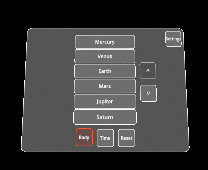
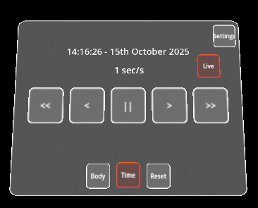

# Overview
Solar-XR is an extended reality, interactable model of the solar system. It allows users to view the solar system as if it is in the room with them. Users can view planets, moons and satellites up close, and control the flow of time to see the solar system at different states.

**Target Hardware:** Meta Quest 3
**Development Platform:** Godot Game Engine (Currently version 4.5)
**Open-Source Licence:** GNU AFFERO GENERAL PUBLIC LICENSE

# Interaction


# Main Features
These features are accessed through three buttons at the bottom of the menu.

## Body Selection
When the application starts, the sun is the "focused" body, meaning that it appears directly in fron of the user, and at a set size ensuring that it is visible.
The body menu allows the focused body to be changed, playing an animation to transition between the two bodies.
When the "Body" button is pressed, a menu is displayed listing the bodies that are in direct orbit around the currently focused body.
When one of these is selected, it becomes the focused body, and the menu is updated to display a new list of bodies in direct orbit around the focused body.
When a body other than the Sun is focused, a back button is shown which will focus the "parent" body, the body which the currently focused body directly orbits.



### Example: 
- Focused body is the Sun, clicking the Body button shows a list of all 8 planets.
- Earth is clicked, and an animation plays enlarging the Earth and moving the simulation so that Earth is in the position of where the Sun used to be.
- The menu then updates to show the bodies orbiting the Earth, the moon and the ISS, and a back button appears.
- The back button is pressed, which bring the focus back to the Sun.

## Time
Pressing the time button displays the time control menu. 

The simulation can display the state of the solar system at any timestamp. To achieve this, the time menu allows the direction and speed of time to be manipulated to observe how the system changes.

The controls do as follows:
- **Live:** Set the simulation time to the current time (determined from system clock), and set the speed to 1 simulation second per real life second.
- **Pause/Play:** Stop/Start time.
- **>:** Set speed of simulation time to 30 simulation minutes per real life second.
- **>>:** Set speed of simulation time to 2 simulation hours per real life second.
- **<:** Set simulation time to reverse at 30 simulation minutes per real life second.
- **<<:** Set simulation time to reverse at 2 simulation hours per real life second.



## Reset
This resets the focused body to the sun, sets the time to live, and resets any position, rotation or scaling modifications.

## Info Nodes
Bodies can info nodes at specific location on them, that when touched/clicked display an information box containing an image, title and text description of that location.

# Other Features
These features are currently found in the settings menu.

## Change Interaction Mode
The 'Touch' and 'Pointer' buttons can be pressed to switch to that respective input mode.

## Move
Displays a menu showing controls which allow the position of the simulation to be changedi.

## Rotate
Displays a menu showing controls allowing the rotation of the simulation to be changed.

## Scale
Displays a menu showing controls allowing the scale of the simulation to be changed.

# Technical Implementation
The program takes the following structure while running, with |- denoting a child node:

```
Main(main.gd)
    |-MainMenuTracker(main_menu_tracker.gd)
    |   |-InfoNodeScreen(info_node_screen.gd) - MainMenu(main_menu.gd)
    |-Simulation
        |-FocusScene(focus_scene.gd)
            |-CentralBody(orbiting_body.gd)
                |-OrbitingBody - OrbitingBody
```

## Main Node (main.gd)
This is the program entrypoint, and the root node of the program.

Performs various setup functions on start, including creating a FocusScene node of the sun and adding it as a child to the Simlation node.

It bridges all communications between the MainMenu node and the Simulation node.

### Focus Scene Swapping
This node handles the focus scene swapping when a new body is focused.
When a child orbiting body is selected, the \_focus\_child() function will be called. This will create a new FocusScene node, with the selected body as the focused body.
The current FocusScene will then be told to start its animation moving to the newly focused body.
When this animation finishes, the current focus scene will be removed, displaying the new scene focusing on the child orbiting body, creating a seamless transition to a new scene with the new body focused.


# Folder Structure

# Data Sources

# Simulation


